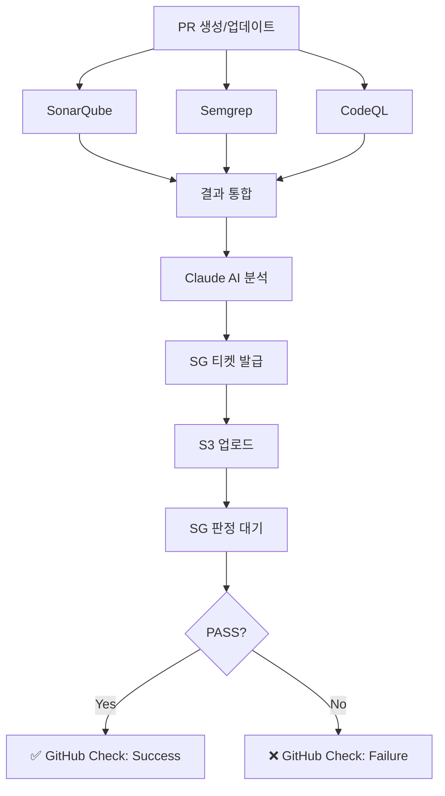

# 🔒 Dark Mac & Cheese - PR SAST Security Pipeline

이 디렉토리는 PR에서 보안 스캔을 수행하고 결과를 Security Gate(SG)에 업로드하는 스크립트들을 포함합니다.

## 📂 파일 구조

```
.github/scripts/
├── llm-analyzer.py      # Claude AI를 이용한 SAST 결과 통합 분석
├── sg-upload.sh         # SG API 티켓 발급 및 S3 업로드
├── requirements.txt     # Python 의존성
└── README.md           # 이 문서
```

## 🔧 스크립트 설명

### 1. `llm-analyzer.py`

**목적**: SonarQube, Semgrep, CodeQL의 결과를 Claude AI로 종합 분석

**사용법**:
```bash
export ANTHROPIC_API_KEY="your-api-key"
python3 llm-analyzer.py <results-directory>
```

**입력**:
- `<results-directory>/sonar-results.json`
- `<results-directory>/codeql-results.sarif`
- `<results-directory>/semgrep-results.json`

**출력**:
- `<results-directory>/final-report.md` (마크다운 형식 보안 리포트)

**특징**:
- 중복 제거 및 심각도별 정렬
- 금융권 보안 규정 관점 평가
- 구체적인 해결 방법 제시
- A~F 등급 보안 점수 산출

---

### 2. `sg-upload.sh`

**목적**: Security Gate API를 통한 리포트 업로드 자동화

**사용법**:
```bash
export SG_API_URL="https://sg.example.com"
export SG_API_TOKEN="your-sg-token"
export GITHUB_REPOSITORY="owner/repo"
export GITHUB_SHA="commit-sha"
export GITHUB_RUN_ID="12345"

./sg-upload.sh <report-file> <pr-number>
```

**프로세스**:
1. SG API 호출 → 티켓 발급
2. S3 presigned URL로 리포트 업로드
3. SG에 업로드 완료 통보

**보안**:
- presigned URL 사용으로 AWS 자격증명 불필요
- 티켓에 repo, sha, run_id 포함 → 위변조 방지

---

## 🔐 필요한 GitHub Secrets

워크플로우 실행을 위해 다음 Secrets를 설정하세요:

### SAST 도구 관련
| Secret | 설명 | 예시 |
|--------|------|------|
| `SONAR_TOKEN` | SonarQube 인증 토큰 | `squ_abc123...` |
| `SONAR_HOST_URL` | SonarQube 서버 URL | `https://sonar.example.com` |
| `SONAR_PROJECT_KEY` | SonarQube 프로젝트 키 | `dark-mac-cheese` |
| `SEMGREP_APP_TOKEN` | Semgrep 앱 토큰 (선택) | `sgp_abc123...` |

### AI 분석 관련
| Secret | 설명 | 예시 |
|--------|------|------|
| `ANTHROPIC_API_KEY` | Claude API 키 | `sk-ant-api03-...` |

### Security Gate 관련
| Secret | 설명 | 예시 |
|--------|------|------|
| `SG_API_URL` | SG API 엔드포인트 | `https://sg-api.example.com` |
| `SG_API_TOKEN` | SG 인증 토큰 | `Bearer token123...` |

---

## 🚀 워크플로우 실행 순서



---

## 🔧 로컬 테스트 방법

### 1. llm-analyzer.py 테스트

```bash
# 1. Python 환경 설정
python3 -m venv venv
source venv/bin/activate
pip install -r requirements.txt

# 2. 테스트 데이터 준비
mkdir -p test-results
# SonarQube, CodeQL, Semgrep 결과 파일을 test-results/에 배치

# 3. 실행
export ANTHROPIC_API_KEY="your-key"
python3 llm-analyzer.py test-results

# 4. 결과 확인
cat test-results/final-report.md
```

### 2. sg-upload.sh 테스트

```bash
# 1. 환경변수 설정
export SG_API_URL="https://sg-dev.example.com"
export SG_API_TOKEN="test-token"
export GITHUB_REPOSITORY="test/repo"
export GITHUB_SHA="abc123"
export GITHUB_RUN_ID="999"

# 2. 실행
chmod +x sg-upload.sh
./sg-upload.sh test-results/final-report.md 123

# 3. 로그 확인
# - 티켓 ID
# - S3 업로드 HTTP 상태
# - SG 통보 결과
```

---

## 📋 트러블슈팅

### llm-analyzer.py 오류

**증상**: `FileNotFoundError: sonar-results.json not found`
- **원인**: 결과 파일이 지정된 디렉토리에 없음
- **해결**: 파일 경로 확인 및 SAST 도구 실행 완료 여부 확인

**증상**: `❌ Claude API 호출 실패: AuthenticationError`
- **원인**: ANTHROPIC_API_KEY가 잘못되었거나 만료됨
- **해결**: API 키 재발급 및 환경변수 재설정

### sg-upload.sh 오류

**증상**: `❌ Error: Invalid ticket response from SG API`
- **원인**: SG API 인증 실패 또는 API 응답 형식 불일치
- **해결**:
  1. SG_API_TOKEN 확인
  2. curl 응답을 직접 확인: `echo $TICKET_RESPONSE | jq .`

**증상**: `❌ Error: S3 upload failed (HTTP 403)`
- **원인**: presigned URL 만료 또는 권한 부족
- **해결**:
  1. TTL 확인 (티켓 발급 후 빠르게 업로드해야 함)
  2. SG 로그에서 presigned URL 생성 상태 확인

---

## 🔒 보안 고려사항

### 1. API 키 관리
- ✅ **DO**: GitHub Secrets에 저장
- ❌ **DON'T**: 코드에 하드코딩, 로그에 출력

### 2. presigned URL
- TTL을 5~15분으로 짧게 설정
- 업로드 완료 후 URL 재사용 불가

### 3. 티켓 위변조 방지
- 티켓에 repo, sha, run_id 포함
- SG는 이 정보로 요청 검증

### 4. 리포트 민감 정보
- 리포트에 secrets, credentials 포함 여부 확인
- 필요 시 민감 정보 마스킹 후 업로드

---

## 📈 개선 아이디어

### 단기
- [ ] 리포트에 trend 분석 추가 (이전 PR 대비 개선도)
- [ ] Critical 이슈 자동 Jira 티켓 생성
- [ ] Slack 알림 통합

### 중장기
- [ ] 머신러닝 기반 False Positive 필터링
- [ ] 커스텀 보안 규칙 추가
- [ ] 실시간 대시보드 연동

---

**Made with ❤️ by Dark Mac & Cheese Team**
